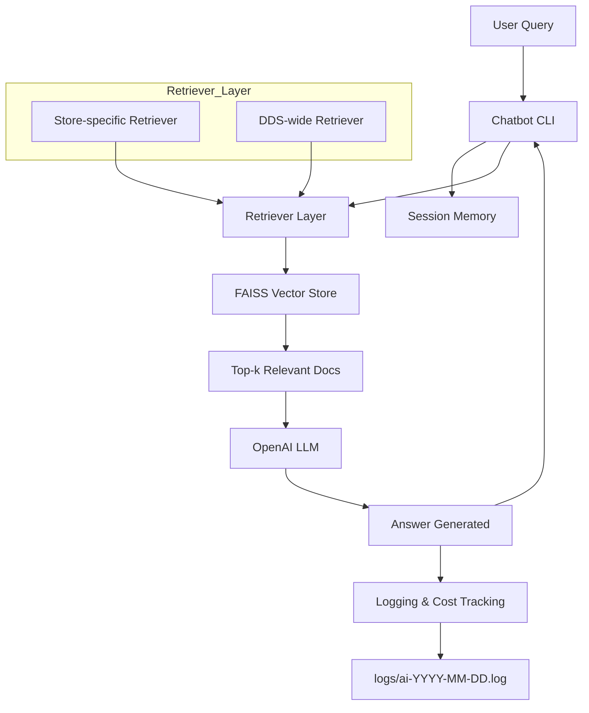

# DDS Hybrid RAG Chatbot (Python)

A **Retrieval-Augmented Generation (RAG)** chatbot for DDS sales data.  
It combines **OpenAI LLM**, **FAISS vector stores**, and **custom retrievers** to answer questions using both **store-specific** and **DDS-wide** data.

---

## 📁 Repository Structure

```rag-ai-chatbot-py/
├─ app/ # Main application logic (retrievers, chatbot, logging)
├─ data/ # Raw sales or training data (CSV/JSON)
├─ faiss_index/ # Stored FAISS indices for fast similarity search
├─ logs/ # Daily logs for token usage, vector retrieval, and costs
├─ vectorstore/ # Serialized vector stores
├─ .env.example # Environment variable template
├─ .gitignore # Ignored files (env, logs, caches)
├─ README.md # Project documentation
├─ sample_data.csv/json # Sample sales/training data
```


---

## ⚙️ Features / Components

- **OpenAI / LLM**: Natural language understanding and response generation.  
- **Embeddings**: Convert text into vectors for semantic similarity searches.  
- **FAISS Vector Store**: Stores vectorized data for fast retrieval.  
- **RAG Chatbot**: Combines retrieved documents with LLM generation for precise answers.  
- **Retriever Layer**: Weighted combination of store-specific and DDS-wide retrievers.  
- **Logging & Cost Tracking**: Tracks token usage, vector retrieval, and approximate costs.  
- **Data Loader / Preprocessing**: Converts raw API or JSON data into LangChain Documents.  
- **Index & Cache Management**: Static DDS indices and dynamic store indices with TTL / hash policies.  
- **Conversational Memory**: Maintains session-wise history for multi-turn conversations.

---

## 💻 Setup Instructions

1. **Clone the repository**:

```bash
git clone git@github.com:afrazahmmad/rag-ai-chatbot-py.git
cd rag-ai-chatbot-py
```

2. **Create & activate virtual environment:**:

```bash
python3 -m venv venv
source venv/bin/activate
```
3. **Install dependencies:**:
```bash
python3 -m venv venv
source venv/bin/activate
```

4. **Set environment variables:**:
```bash
cp .env.example .env
# Edit .env with your OpenAI API key, database connections, etc.
```

5. **Run the CLI chatbot:**:
```bash
python -m app.run_cli
```
## 🧩 RAG Chatbot Architecture


